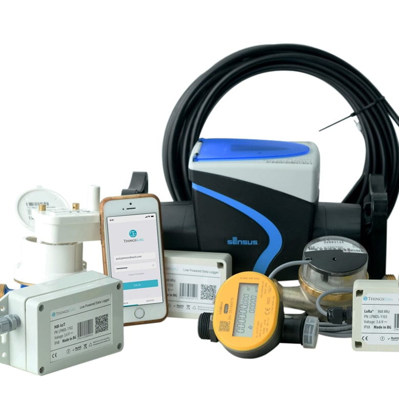
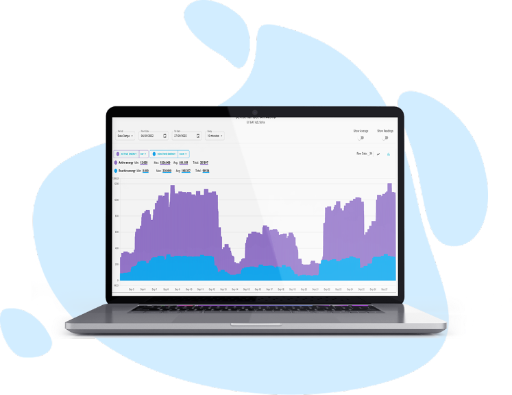
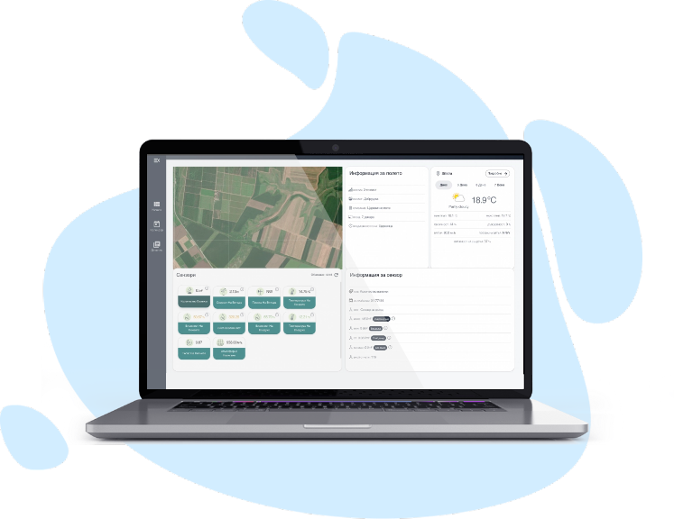

<p align="center">
  
</p>

# ThingsLog Vue Monitoring Template

    

A Vue 3 portal template for water installers and system integrators building customer monitoring dashboards on ThingsLog.

> For installers, water-system integrators, and utility solution providers: launch your own branded monitoring and alerting app for private customers, individuals, businesses, and utilities without starting from zero.

## Who This Is For

- Water-meter installers who want to keep serving customers after installation
- Water-system integrators building portals for utilities, municipalities, buildings, farms, and private owners
- Companies that want to launch a white-label monitoring and alerting business
- Utilities and service providers that need their own app, portal, alerts, reports, and customer workflows
- Technical teams using Codex or Claude to turn ThingsLog APIs into production-ready customer experiences

## Why This Exists

ThingsLog provides remote IoT monitoring and automation for smart metering, water utilities, pressure, tank level, pumps, energy, gas, agriculture, buildings, and industrial operations. These repositories help installers and system integrators turn field devices into a sellable monitoring and alerting service with their own app, portal, customer workflows, and recurring revenue model.

## What You Get

- Vue monitoring dashboard
- Device and site summary
- Counter history table
- Alarm panel
- Local backend proxy for ThingsLog REST calls

## Best Fit

- **Stack:** Vue 3, Vite, Express backend proxy, monitoring and alerting UI
- **Use when:** Your team prefers Vue and wants a branded portal for private customers, residential sites, buildings, or utilities.

## ThingsLog Solutions to Build On

These templates are designed around real ThingsLog solution areas that installers and integrators can package into their own app, portal, reports, and alerting service.

<table>
  <tr>
    <td width="33%">
      <a href="https://thingslog.com/thingslog-solutions/intelligent-water/"></a>
      <br />
      <strong><a href="https://thingslog.com/thingslog-solutions/intelligent-water/">Intelligent Water</a></strong>
      <br />
      Smart metering, NRW, pressure, pumps, wastewater, reservoirs, tanks, and customer alerts. Supports popular water meter brands via LoRa, NB-IoT, or wireless M-Bus, plus Modbus devices and analog 4-20 mA or 0-3 V sensors.
    </td>
    <td width="33%">
      <a href="https://thingslog.com/thingslog-solutions/energy-consumption-monitoring/"></a>
      <br />
      <strong><a href="https://thingslog.com/thingslog-solutions/energy-consumption-monitoring/">Energy Monitoring</a></strong>
      <br />
      Consumption tracking, alarms, reports, optimization workflows, and business efficiency dashboards.
    </td>
    <td width="33%">
      <a href="https://thingslog.com/thingslog-solutions/thingslog-smart-agriculture/"></a>
      <br />
      <strong><a href="https://thingslog.com/thingslog-solutions/thingslog-smart-agriculture/">Smart Agriculture</a></strong>
      <br />
      Irrigation, soil and environmental monitoring, farm operations, alerts, and field reporting.
    </td>
  </tr>
</table>


Water compatibility for your own apps:

- Works with popular water meter brands through LoRa, NB-IoT, or wireless M-Bus integrations.
- Can collect from Modbus devices and industrial controllers.
- Can collect from analog sensors such as 4-20 mA and 0-3 V pressure, level, flow, and environmental sensors.
- Partners and customers can use ThingsLog data in their own apps, portals, alerting services, reports, and integrations.

Water-focused starting points:

- [Remote Smart Water Metering](https://thingslog.com/thingslog-solutions/intelligent-water/smart-water-metering/)
- [NRW Leak Detection and Control](https://thingslog.com/leak-detection-nrw-monitoring-and-control/)
- [Pressure Management and Control](https://thingslog.com/thingslog-solutions/intelligent-water/water-pressure-monitoring/)
- [Pumping Station Automation and Control](https://thingslog.com/thingslog-solutions/intelligent-water/pumping-station-automation-and-control/)
- [Wastewater Monitoring](https://thingslog.com/thingslog-solutions/intelligent-water/wastewater-monitoring/)
- [Tank Level Monitoring](https://thingslog.com/tank-level-monitoring/)

## Start in 5 Minutes

```bash
git clone https://github.com/ThingsLog/thingslog-vue-monitoring-template.git
cd thingslog-vue-monitoring-template
cp .env.example .env
npm install
npm run dev
```

## Generate Your ThingsLog Token

You need a ThingsLog API token before connecting real devices. For a quick test, use direct login and copy the bearer token from the `Authorization` response header:

```bash
curl -i -X POST "https://iot.thingslog.com:4443/login" \
  -H "Content-Type: application/json" \
  -d '{"username":"YOUR_USERNAME","password":"YOUR_PASSWORD"}'
```

For installer portals, integrator backends, and production integrations, generate a long-term API token:

```bash
KEYCLOAK_TOKEN=$(curl -s -X POST "https://iot.thingslog.com/keycloak/realms/thingslog/protocol/openid-connect/token" \
  -H "Content-Type: application/x-www-form-urlencoded" \
  -d "grant_type=password" \
  -d "client_id=thingslog-admin" \
  -d "username=YOUR_USERNAME" \
  -d "password=YOUR_PASSWORD" | node -e 'let s="";process.stdin.on("data",d=>s+=d);process.stdin.on("end",()=>console.log(JSON.parse(s).access_token))')

curl -i -X POST "https://iot.thingslog.com:4443/api/api-token?expirationTimeHours=720&name=installer-demo-token" \
  -H "Authorization: Bearer $KEYCLOAK_TOKEN"
```

Copy the generated API token into `THINGSLOG_TOKEN`, set `THINGSLOG_MOCK=false`, choose a real `THINGSLOG_DEVICE_NUMBER`, and start the app. Now you can rock and roll with live ThingsLog data.

## Connect Real ThingsLog Data

Mock mode is enabled by default so the project starts without credentials. To connect real devices, set these values in `.env` or the framework-specific env file:

```bash
THINGSLOG_MOCK=false
THINGSLOG_BASE_URL=https://iot.thingslog.com:4443
THINGSLOG_TOKEN=your_api_token
THINGSLOG_DEVICE_NUMBER=00000109
THINGSLOG_SENSOR_INDEX=0
THINGSLOG_FROM_DATE=2026-02-01T00:00:00+02:00
THINGSLOG_TO_DATE=2026-02-02T00:00:00+02:00
```

Security rule: ThingsLog API tokens stay server-side. Do not expose them through browser variables such as `VITE_*`, `NEXT_PUBLIC_*`, or mobile app bundles.

## Start with Codex

Open this repo in Codex and paste:

```text
Use this repository to build a branded ThingsLog monitoring and alerting app for installers, water-system integrators, private customers, individuals, businesses, or utilities. Keep ThingsLog credentials server-side and preserve mock mode.

First inspect README.md, AGENTS.md, CLAUDE.md, and the existing ThingsLog client code.
Then propose the smallest useful first version for an installer-ready monitoring and alerting portal.
After implementing, run the available build or check commands and summarize how to start it.
```

## Start with Claude

Open this repo in Claude and paste:

```text
You are helping an installer or water-system integrator build a branded ThingsLog monitoring and alerting application.
Read README.md, AGENTS.md, and CLAUDE.md before making changes.
Use ThingsLog concepts: customer, site, device, sensor, counter, measurement, alarm.
Keep ThingsLog API tokens server-side.
Preserve mock mode so the app can be demonstrated without credentials.
Build the next useful installer or integrator feature and explain how to run it locally.
```

## Key Files

- `src/App.vue`
- `server/thingslog-client.js`
- `AGENTS.md`
- `CLAUDE.md`

## Business Ideas for Installers and Integrators

- Branded monitoring portal for private water customers, households, buildings, farms, and industrial sites
- Utility-facing dashboard for district metering, pressure zones, tanks, pumping stations, and alarm response
- Alerting service for leaks, abnormal consumption, missed transmissions, low battery, pressure thresholds, and tank level
- Installer operations portal for device commissioning, site handover, maintenance, and customer support
- Monthly monitoring package with reports, notifications, SLA checks, and field-service follow-up
- Integration service for billing, ERP, GIS, BI, SCADA, maintenance systems, and customer mobile apps

## Template Family

This repository is part of the ThingsLog installer and integrator template family. For stack selection, copy-paste startup commands, Codex prompts, Claude prompts, and security-review prompts, start here:

- https://github.com/ThingsLog/thingslog-partner-ai-examples

## ThingsLog Links

- Website: https://thingslog.com
- REST Swagger UI: https://iot.thingslog.com:4443/swagger-ui.html
- Support: https://support.thingslog.com

## License

License terms to be selected by ThingsLog before public release.
